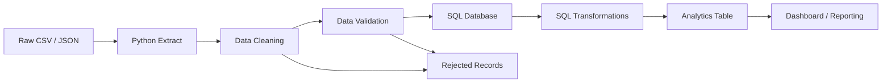
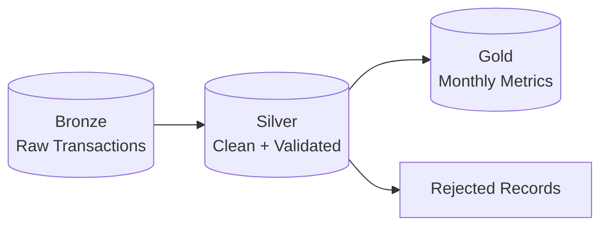

# 🚀 Data Engineering Daily Lab — Python + SQL

> A compact hands-on project for practicing **Data Engineering fundamentals** with **Python**, **SQL**, and an ETL-style workflow.


---

## 🎯 Objective

The goal of this lab is to build a small but realistic data pipeline that:

- extracts raw transaction data,
- cleans and validates it with Python,
- loads the transformed data into a SQL database,
- calculates useful business metrics with SQL,
- demonstrates a clean Data Engineering workflow.

---

## 🏗️ Architecture



### Pipeline stages

| Stage | Technology | Purpose |
|---|---|---|
| Extract | Python | Read raw files |
| Transform | Python | Clean, normalize and validate |
| Load | Python + SQL | Insert processed records |
| Model | SQL | Create analytical datasets |
| Analyze | SQL | Generate KPIs and insights |

---

## 📂 Suggested Project Structure

```text
data-engineering-python-sql/
│
├── data/
│   ├── raw/
│   │   └── transactions.csv
│   └── processed/
│       └── clean_transactions.csv
│
├── src/
│   ├── extract.py
│   ├── transform.py
│   └── load.py
│
├── sql/
│   ├── create_tables.sql
│   ├── transformations.sql
│   └── analytics.sql
│
├── tests/
│   └── test_transform.py
│
├── requirements.txt
└── README.md
```

---

## 🐍 Python — Transformation Example

```python
from pathlib import Path
import pandas as pd


RAW_FILE = Path("data/raw/transactions.csv")
OUTPUT_FILE = Path("data/processed/clean_transactions.csv")


def clean_transactions(df: pd.DataFrame) -> pd.DataFrame:
    """Clean and validate transaction data."""

    df = df.copy()

    # Standardize column names
    df.columns = [
        column.strip().lower().replace(" ", "_")
        for column in df.columns
    ]

    # Remove duplicated rows
    df = df.drop_duplicates()

    # Convert data types
    df["transaction_date"] = pd.to_datetime(
        df["transaction_date"],
        errors="coerce"
    )

    df["amount"] = pd.to_numeric(
        df["amount"],
        errors="coerce"
    )

    # Remove invalid records
    df = df.dropna(
        subset=[
            "transaction_id",
            "customer_id",
            "transaction_date",
            "amount",
        ]
    )

    # Business validation
    df = df[df["amount"] > 0]

    # Add derived fields
    df["transaction_year"] = df["transaction_date"].dt.year
    df["transaction_month"] = df["transaction_date"].dt.month

    return df


def main() -> None:
    df = pd.read_csv(RAW_FILE)

    clean_df = clean_transactions(df)

    OUTPUT_FILE.parent.mkdir(parents=True, exist_ok=True)
    clean_df.to_csv(OUTPUT_FILE, index=False)

    print(f"Raw rows: {len(df)}")
    print(f"Clean rows: {len(clean_df)}")


if __name__ == "__main__":
    main()
```

---

## 🗄️ SQL — Create the Main Table

```sql
CREATE TABLE transactions (
    transaction_id BIGINT PRIMARY KEY,
    customer_id BIGINT NOT NULL,
    transaction_date DATETIME NOT NULL,
    amount DECIMAL(12, 2) NOT NULL,
    transaction_year SMALLINT NOT NULL,
    transaction_month TINYINT NOT NULL,

    INDEX idx_transactions_customer_id (customer_id),
    INDEX idx_transactions_date (transaction_date)
);
```

---

## 🔄 SQL — Build an Analytics Table

Instead of repeatedly calculating the same aggregation, we can build a dedicated analytics table.

```sql
CREATE TABLE monthly_customer_metrics AS
SELECT
    customer_id,
    YEAR(transaction_date) AS year,
    MONTH(transaction_date) AS month,
    COUNT(*) AS transaction_count,
    SUM(amount) AS total_amount,
    AVG(amount) AS average_amount,
    MAX(amount) AS max_amount
FROM transactions
GROUP BY
    customer_id,
    YEAR(transaction_date),
    MONTH(transaction_date);
```

---

## 📊 SQL — Useful Data Engineering Queries

### 1. Monthly Revenue

```sql
SELECT
    DATE_FORMAT(transaction_date, '%Y-%m') AS month,
    ROUND(SUM(amount), 2) AS revenue
FROM transactions
GROUP BY DATE_FORMAT(transaction_date, '%Y-%m')
ORDER BY month;
```

### 2. Top Customers

```sql
SELECT
    customer_id,
    COUNT(*) AS total_transactions,
    ROUND(SUM(amount), 2) AS total_spent
FROM transactions
GROUP BY customer_id
ORDER BY total_spent DESC
LIMIT 10;
```

### 3. Detect Duplicate IDs

```sql
SELECT
    transaction_id,
    COUNT(*) AS duplicate_count
FROM transactions
GROUP BY transaction_id
HAVING COUNT(*) > 1;
```

### 4. Detect Data Quality Problems

```sql
SELECT
    SUM(CASE WHEN customer_id IS NULL THEN 1 ELSE 0 END) AS missing_customer,
    SUM(CASE WHEN amount <= 0 THEN 1 ELSE 0 END) AS invalid_amount,
    SUM(CASE WHEN transaction_date IS NULL THEN 1 ELSE 0 END) AS missing_date
FROM transactions;
```

---

## 🧠 Data Quality Rules

A good pipeline should validate data before loading it.

```text
transaction_id      → must be unique
customer_id         → must not be null
transaction_date    → must be a valid date
amount              → must be numeric and > 0
duplicate rows      → must be removed
```

A production pipeline should also store invalid records separately instead of silently deleting them.

Example:

```text
valid records   ─────► transactions
invalid records ─────► rejected_transactions
```

---

## ⚡ Incremental Loading Concept

Loading the full dataset every time is inefficient.

A better strategy is to process only new records.

```sql
SELECT *
FROM source_transactions
WHERE updated_at > :last_successful_run;
```

This pattern is commonly used in:

- ETL pipelines
- ELT pipelines
- Change Data Capture workflows
- Lakehouse ingestion
- Databricks pipelines

---

## 🔁 Idempotency

A Data Engineering pipeline should be **idempotent**.

Running the same pipeline twice should not create duplicate records.

One possible pattern:

```sql
INSERT INTO transactions (
    transaction_id,
    customer_id,
    transaction_date,
    amount
)
VALUES (?, ?, ?, ?)
ON DUPLICATE KEY UPDATE
    customer_id = VALUES(customer_id),
    transaction_date = VALUES(transaction_date),
    amount = VALUES(amount);
```

---

## 📈 Pipeline Monitoring

Important metrics to monitor:

| Metric | Why it matters |
|---|---|
| Rows extracted | Validate source volume |
| Rows loaded | Confirm successful ingestion |
| Rejected rows | Detect data quality issues |
| Execution time | Detect performance degradation |
| Duplicate records | Ensure data integrity |
| Pipeline status | Track success or failure |

Example Python logging:

```python
import logging

logging.basicConfig(
    level=logging.INFO,
    format="%(asctime)s | %(levelname)s | %(message)s"
)

logging.info("Starting transaction pipeline")
```

---

## 🧪 Simple Validation Function

```python
def validate_dataframe(df):
    required_columns = {
        "transaction_id",
        "customer_id",
        "transaction_date",
        "amount",
    }

    missing_columns = required_columns - set(df.columns)

    if missing_columns:
        raise ValueError(
            f"Missing required columns: {sorted(missing_columns)}"
        )

    if df["transaction_id"].duplicated().any():
        raise ValueError("Duplicate transaction IDs detected")

    if (df["amount"] <= 0).any():
        raise ValueError("Invalid transaction amount detected")

    return True
```

---

## 🔍 SQL Performance Tip

Indexes are useful when columns are frequently used in:

- `WHERE`
- `JOIN`
- `ORDER BY`
- lookup operations

Example:

```sql
CREATE INDEX idx_transactions_customer_date
ON transactions(customer_id, transaction_date);
```

But avoid creating indexes blindly.

Too many indexes can:

- increase storage usage,
- slow down `INSERT`,
- slow down `UPDATE`,
- increase maintenance cost.

Always inspect the execution plan:

```sql
EXPLAIN
SELECT
    customer_id,
    SUM(amount)
FROM transactions
WHERE transaction_date >= '2026-01-01'
GROUP BY customer_id;
```

---

## 🧱 Bronze → Silver → Gold Mapping

This small Python + SQL project can also be mapped to the **Medallion Architecture**.



### Bronze

Raw data exactly or almost exactly as received from the source.

### Silver

Cleaned, normalized, deduplicated, and validated data.

### Gold

Business-ready aggregations used for dashboards, reporting, and analytics.

---

## ☁️ How This Maps to Databricks

The same project can later be implemented with:

```text
CSV / JSON / API
       ↓
Lakeflow Connect
       ↓
Bronze Delta Table
       ↓
Lakeflow Declarative Pipelines
       ↓
Silver Delta Table
       ↓
Gold Delta Table
       ↓
Databricks SQL / Dashboard
```

This makes the lab useful for practicing concepts relevant to the **Databricks Data Engineer Associate** certification.

---

## ✅ Skills Demonstrated

This project demonstrates:

- Python data processing
- SQL querying
- ETL design
- data validation
- data quality checks
- SQL indexing
- incremental processing
- idempotent pipelines
- analytical modeling
- Medallion Architecture
- pipeline monitoring
- Data Engineering best practices

---


## 👨‍💻 Author

**Majd Machlouch**

Data Engineering • Python • SQL • Databricks • Apache Spark

---

## © Copyright

Copyright © 2026 **Majd Machlouch**. All rights reserved.

This educational project and its documentation were created for the personal technical portfolio of **Majd Machlouch**.
